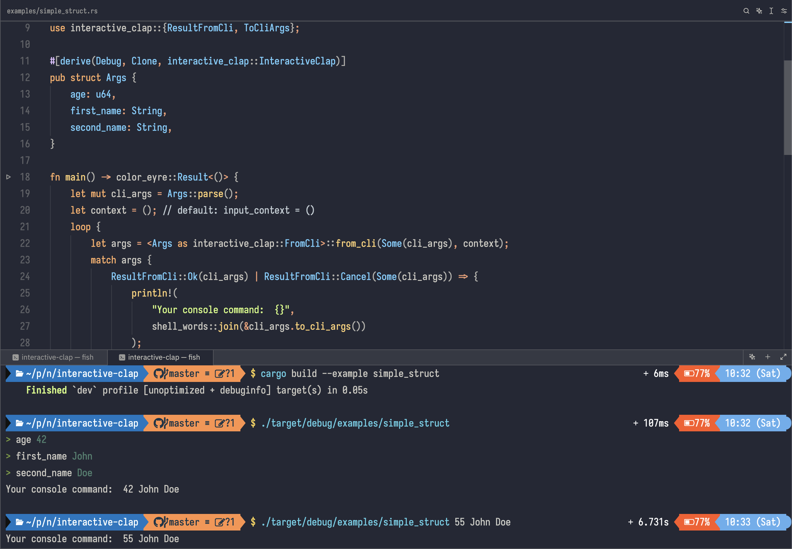

# Interactive clap

> **`interactive-clap` is a Rust crate of helpers for [`clap`](https://github.com/clap-rs/clap) that enable interactive prompts for structs.**

See examples in the [`examples/`](https://github.com/near-cli-rs/interactive-clap/tree/master/examples) folder.

  

See it in action in [`near-cli-rs`](https://near.cli.rs) and [`bos-cli-rs`](https://bos.cli.rs).
